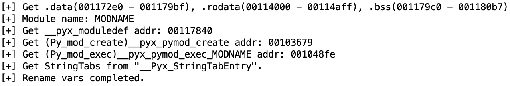

# cythonHelper

A Cython reverse helper with analyzing Ghidra P-Code. (For 2024 CTFCON)

> only test in python 3.10 and some features may vary depending on the Python version.

## usage

1. Use Ghidra to open the .so cython file, and put this script into ghidra's script directory.

2. "Window" > "Script Manager" > double click this script.

3. Get infos in the Output window and get new labels in the Decompiler window.

   

## TODO

- **Update to the IDAPython script.**
- Add support to the .pyd file.
- Support more versions of Python.
- Print the general process of the function.
- Get Python's list from pseudocode.